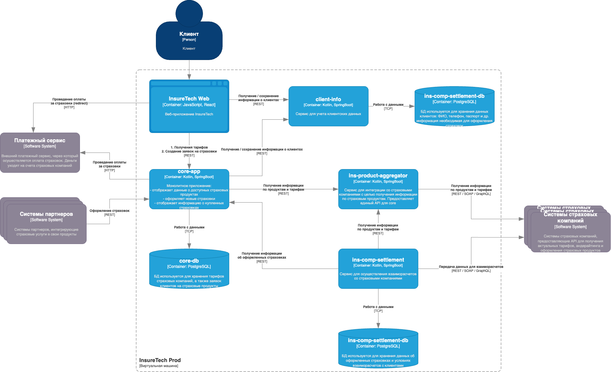

# Контекст финального задания 8-го спринта (InsureTech)

## О компании
InsureTech — агрегатор страховых услуг. Продукты:
- **B2C**: сайт для подбора и оформления страховок (жизни, ОСАГО и пр.).
- **B2B**: API для партнёров, интегрирующих страховые услуги в свои продукты.

## Текущие проблемы (требуют решения)
1. **Низкая производительность сайта**  
   - Страницы загружаются минутами или не загружаются под нагрузкой.
   - Пиковая нагрузка: 50 RPS на поиск, 10 RPS на оформление.
   - Падает NPS и retention.

2. **Нарушение SLA для B2B-клиентов**  
   - Один партнёр создаёт 250 RPS (при согласованных 20 RPS), «съедая» ресурсы.
   - Другие партнёры страдают от недоступности API.

3. **Приложение падает**  
   - Инциденты обнаруживаются только от пользователей (нет мониторинга).
   - Простой стоит 500 тыс. руб./час + репутационные потери.
   - Партнёры отказываются продлевать контракты.

## Архитектура (текущее состояние)
- **Деплой**: Kubernetes (одна зона доступности).
- **База данных**: PostgreSQL (единый экземпляр на отдельной ВМ, схемы на сервис).
- **Бэкенд**:
  - `core-app` — монолит (отображение продуктов, оформление заявок, ЛК).
  - `client-info` — управление клиентскими данными.
  - `ins-product-aggregator` — агрегация продуктов страховых компаний, запросы ОСАГО.
  - `ins-comp-settlement` — взаиморасчёты со страховыми (раз в месяц).
- **Фронтенд** → `core-app` через REST.
- **Партнёры** → API через Kubernetes LoadBalancer (публичный доступ).
- **Интеграции**: 5 страховых компаний.

### Диаграмма C4 контейнеров

## Планы
Проведение крупной рекламной кампании → ожидается кратный рост нагрузки.

## Цель работы
Проработать решения для описанных проблем, обеспечить highload, отказоустойчивость и соблюдение SLA.

## Технологический стек для решений
- **Инструменты**: Minikube, kubectl, Python, pip, Locust, draw.io.
- **Платформа**: Kubernetes, NGINX, PostgreSQL, Kafka/RabbitMQ/Artemis (по выбору).
- **Паттерны**: Event-Driven, Saga, CQRS, Bulkhead, Rate Limiting, Failover (Active-Active/Passive), Transactional Outbox.

## Структура репозитория
- `Task1/` … `Task6/` — директории с решениями заданий.
- Каждое задание содержит необходимые файлы (схемы, конфиги, код, описание).
